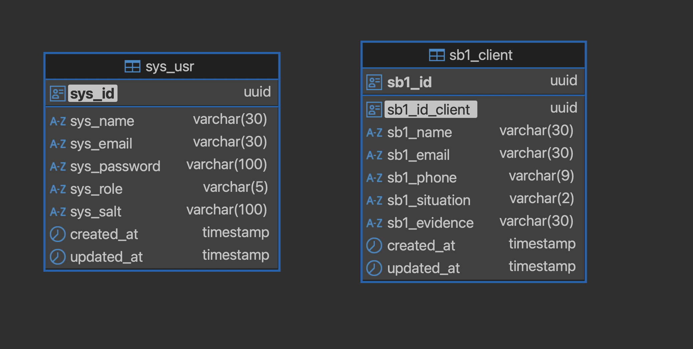

## Rei do acolchoado backend

<details>
<summary>Primeiros passos</summary>

```bash
# Clone o projeto para sua máquina
# Se não tiver chave ssh cadastra, 
# lembre-se de cadastrar ou usar o link do projeto para o clone
git clone git@github.com:Exilium-Free-Wisdom/rei-do-acolchoado-back.git

# Instale as dependências do projeto
yarn 
```
</details>

<details>
<summary>🐳 Iniciando a aplicação docker</summary>

```bash
# Inicie os containers do compose
# A aplicação estará disponível em `http://localhost:3000` em modo de desenvolvimento
docker-compose up --build

# É possível ver os logs da aplicação com `docker logs -n 20 -f <nome-do-container>`
docker logs -n 20 -f store_manager
```
</details>

## Diagrama das tabelas do banco de dado




## Excalidraw do projeto

<a href="https://excalidraw.com/#json=9R2saPUdh4emyMFw-S6vI,UKAfUxfy8yF8Hrv9JZnR8g">Englobamento do projeto</a>